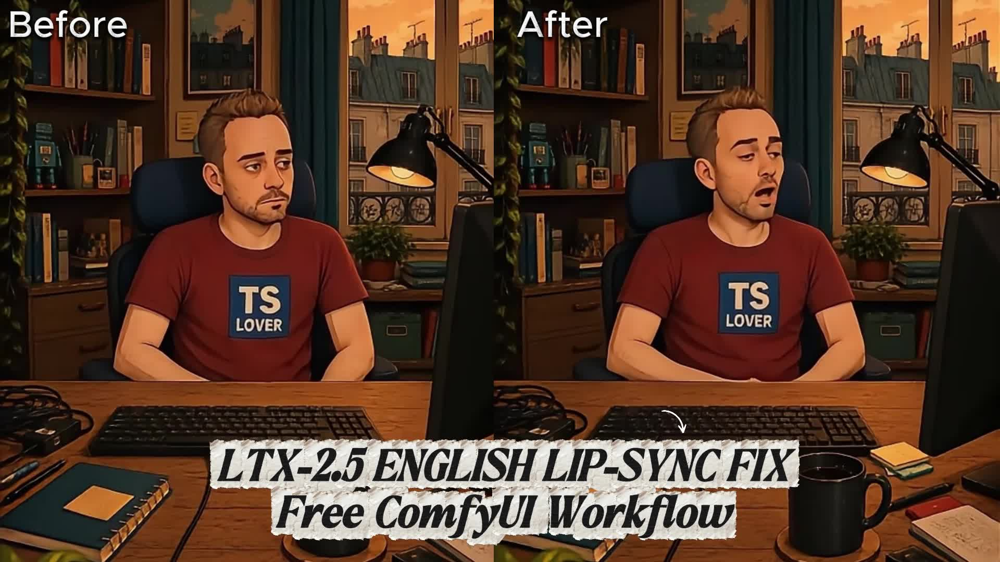

# QuokkaiLab LTX-2.5 Lip-Sync Fix

**Free ComfyUI workflow for improved English lip-sync conditioning in LTX-2.5 — while keeping the original clean audio.**

**[Watch / download the full BEFORE / AFTER demo](https://github.com/sducly/quokkai-lab-ltx25-lipsync-fix/raw/refs/heads/main/assets/demo/quokkai-lab-fix-lip-sync.mp4)**

Same image. Same voice. Same prompt. Same seed. **Only the conditioning changes.**
Within each matched test, models, negative prompt, duration, FPS and generation
settings are also identical. Both outputs use the same clean speech soundtrack.

## Download / use this workflow

**[Download the QuokkaiLab fix workflow](https://github.com/sducly/quokkai-lab-ltx25-lipsync-fix/raw/refs/heads/main/workflows/ltx25-quokkailab-fix.json)** —
[`workflows/ltx25-quokkailab-fix.json`](workflows/ltx25-quokkailab-fix.json)

**[Download the reproducibility baseline](https://github.com/sducly/quokkai-lab-ltx25-lipsync-fix/raw/refs/heads/main/workflows/ltx25-baseline.json)** —
[`workflows/ltx25-baseline.json`](workflows/ltx25-baseline.json)

The baseline is our equivalent pipeline with the conditioning treatment disabled.
It is **not an official LTX workflow**. Download the repository with GitHub's
**Code → Download ZIP** as well: the workflows need the bundled custom node below.

English speech sometimes produced weak or unstable mouth motion in our production
workflow. This empirical workaround preprocesses a copy of speech for LTX
conditioning. The final video keeps clean speech. Results vary with the voice,
speech, prompt and visual input; some baselines already work well. This is not an
official or universal fix, and the exact model-level cause is unknown.

## Quick start

1. **Install the five exact model files** in the [model directories listed below](#model-files).
   The reference setup is ComfyUI **0.34.0** with frontend **1.51.9** and nested
   subgraph support. See [Requirements](#requirements) for the tested environment.
2. **Install the bundled node.** Copy the entire `custom_nodes/quokkailab_audio`
   folder from this repository into your ComfyUI installation's `custom_nodes/`.
   The resulting file should be `custom_nodes/quokkailab_audio/__init__.py`.
   Required LTX and video nodes are in the tested ComfyUI core; no other
   third-party custom-node pack is required by these workflows.
3. **Install its Python packages using ComfyUI's Python**, from the ComfyUI
   directory: `python -m pip install -r custom_nodes/quokkailab_audio/requirements.txt`.
   Here `python` must be the interpreter that runs your ComfyUI, not an unrelated
   system Python. Use your installation's virtual-environment or bundled Python
   executable as appropriate. Dependencies are NumPy, SciPy and SoundFile;
   keep ComfyUI's existing PyTorch installation. **Restart ComfyUI.**
4. **Import the fix workflow** by dragging
   [ltx25-quokkailab-fix.json](workflows/ltx25-quokkailab-fix.json) onto the canvas.
   Expand the model-loader subgraph and select the exact filenames listed below.
5. **Provide the image.** In the input-image group, upload/select your portrait in
   the start-image loader. Select the same image in the end-image loader too;
   the optional end-frame guide is off by default. This is image-to-video:
   **no source video is required**. A clear mouth and 9:16 image are recommended.
6. **Provide the speech.** Upload/select a clean mono WAV in the audio loader.
   Prefer PCM16/PCM24 at 44.1 or 48 kHz with peaks below full scale. Start with
   about 2–3 seconds of speech. Stereo, silent, clipped or overlong audio is
   rejected; see [preserved settings](#preserved-generation-settings).
7. **Set the visual prompt and queue.** Describe the speaker's actions to match
   your audio. The supplied prompt contains a sample sentence; replace it for
   your clip, or use a visual description without quoting dialogue. In our demo
   preparation, visual-only wording avoided subtitle artifacts on selected clips;
   it is not a guaranteed subtitle remedy. Leave `enable_fix` on in the amber
   audio-conditioning group and keep the validated generation settings.
8. **Find the final video** in the output group's `SaveVideo` node and under
   `ComfyUI/output/QuokkaiLab/ltx25_fix...`. This MP4 receives the clean audio branch;
   the processed conditioning audio is not its soundtrack.
9. **Compare if desired.** Import [ltx25-baseline.json](workflows/ltx25-baseline.json)
   and select the exact same inputs and prompts. Keep all seeds and settings
   unchanged. Baseline outputs use `ComfyUI/output/QuokkaiLab/ltx25_baseline...`.
   Follow [DEMO.md](DEMO.md) for the matched-pair protocol.

The validated GPU setup was an RTX 4090 Laptop GPU with **16 GB VRAM and 64 GB
system RAM**. The BF16 models caused severe RAM pressure and poor responsiveness
while loading. This is a tested setup, **not a minimum requirement or a promise of
comfortable multitasking**. Lower-memory variants and Linux/macOS installation
were not validated for this package. See [VALIDATION.md](VALIDATION.md).

## What changes

The baseline is this same two-stage LTX workflow with **unprocessed conditioning**.
It is not claimed to be the official upstream default workflow. The fix file
changes only `enable_fix` and the output filename prefix; no baseline settings
have been weakened.

For clean mono samples `x[n]` at sample rate `sr`, the fix:

1. Multiplies by `0.55 + 0.45*cos(2*pi*70*n/sr)`.
2. Applies SciPy's order-2 Butterworth band-pass, 180–6500 Hz, using
   `sosfiltfilt` (forward/backward filtering).
3. Normalizes the filtered peak to 0.95, then restores the original samples
   through the first and from the last crossing of the -40 dBFS threshold,
   and restores every original zero sample.
4. Quantizes the driver to PCM24 and checks sample count, sample rate,
   finiteness, peaks and first/last threshold crossings.

This recipe was called `ringmod70` during development. More precisely, its
positive-offset multiplier performs amplitude modulation. It does not time-stretch,
translate speech, change playback speed, or use a compressor. The implementation
uses **NumPy, SciPy and SoundFile/libsndfile**, not an FFmpeg audio filter.

The shared timing code trims silence, adds the configured silence and fits an
`8k+1` frame count. It checks that clean and transformed audio have identical
placement. LTX encodes the chosen conditioning audio and freezes its latent in
both sampling stages. The clean branch goes directly to the video mux; audio
latents are never decoded for the soundtrack. “Clean” means unchanged speech
samples apart from shared trim/padding and the output codec's encoding.

**Observation:** the production workflow was developed to improve English
speech/lip-sync on selected clips. This package preserves its numerical recipe.
**Unknown:** the underlying model behavior and generality of the improvement.
No causal explanation, quality percentage or universal English-language fix is
established. Judge the matched before/after pair on your inputs.

## Requirements

The tested local core is **ComfyUI 0.34.0**, with frontend **1.51.9**.
The original source workflow recorded frontend 1.48.7. Use a frontend that supports
nested subgraphs. These are reference versions, not experimentally determined minima.
Older node-version metadata in the source was stale and is not a requirements list.
See [VALIDATION.md](VALIDATION.md) for what was actually exercised.

The only additional custom node in this package is `quokkailab_audio`.
The required LTX, switch, math, model loader and video nodes are present in the
reference ComfyUI core. `node-inventory.json` lists every graph node type, including
frontend-only notes/reroutes. A separate ComfyUI-LTXVideo checkout is not required
by the tested core registration. Fish Audio and other voice-cloning plugins are
not dependencies.

Additional Python dependencies: `numpy>=1.26,<2.5`, `scipy==1.15.1`, and
`soundfile>=0.13,<0.14`. CPU verification used NumPy 1.26.4, SciPy 1.15.1,
SoundFile 0.13.1 and PyTorch 2.12.1+cu130. The ranges follow the production
environment constraints; not every permitted combination has been tested.
SoundFile needs libsndfile (normally supplied by its wheels).

No external executable is called by this custom node. ComfyUI's own `LoadAudio`,
`CreateVideo` and `SaveVideo` use its audio/video dependencies. The original
production wrapper used an FFmpeg remux to restore clean speech; this graph sends
clean speech directly to `CreateVideo`, eliminating that external remux step.
Real GPU outputs were decoded and checked for timing and clean-audio alignment; see [VALIDATION.md](VALIDATION.md).

## Model files

These are the exact references in the working graph; no quantization or model
substitution is introduced. Obtain weights from the
[Lightricks LTX-2.5 model repository](https://huggingface.co/Lightricks/LTX-2.5/tree/main)
and select the files in the model loader subgraph.
The exact locally tested filenames, byte sizes and SHA256 hashes are recorded in
[model-reference.json](model-reference.json); no weights are included.

| ComfyUI directory | Filename |
| --- | --- |
| `models/diffusion_models/` | `ltx-2.5-22b-distilled-transformer-bf16.safetensors` |
| `models/text_encoders/` | `gemma4-12b-with-proj-ltx-2.5-bf16.safetensors` |
| `models/vae/` | `ltx-2.5-audio-vae-bf16.safetensors` |
| `models/vae/` | `ltx-2.5-video-vae-bf16.safetensors` |
| `models/latent_upscale_models/` | `ltx-2.5-latent-spatial-upscaler-x2-bf16-1.0.safetensors` |

## Preserved generation settings

| Setting | Value |
| --- | --- |
| Image input | Portrait 9:16; a clear, front-facing mouth; suggested 576 × 1024 |
| Stage 1 / final resolution | 288 × 512 / 576 × 1024 |
| FPS | 24 |
| Stage 1 | 8 steps, Euler ancestral, CFG 1, seed 42 |
| Stage 1 sigmas | `1, .99375, .9875, .98125, .975, .909375, .725, .421875, 0` |
| Stage 2 | 3 steps, Euler, CFG 1, seed 42 |
| Stage 2 sigmas | `.85, .7250, .4219, 0` |
| Start-image strength / image compression | 0.7 / 18 (compression is not FPS) |
| End-frame guide | Off by default; optional, strength 0.7 in both stages |
| Trim threshold / retained edge | -40 dBFS / 20 ms |
| Silence before / after / safety margin | 0.5 s / 1 s / 0.3 s |
| Mux shift / audio start offset | 0 ms / 0 s |
| Duration ceiling | 5 s configured; at 24 fps, max 113 frames = 4.7083 s |
| Tiled VAE decode | Tile 512, overlap 64, temporal size 128, temporal overlap 32 |

The timing node reduces safety margin, then trailing silence, then leading silence
if necessary. Speech that still does not fit is rejected, never silently truncated.
Do not change the -40 dBFS threshold: the recipe validates its boundaries at that
threshold. Prefer mono PCM16/PCM24 WAV at 44.1 or 48 kHz. Stereo, silent, nonfinite
or full-scale-clipped inputs are rejected in both arms. The filter mathematically
requires a sample rate above 13 kHz. Lossy formats are not recommended for the
reproducibility demo because decoding can change sample values and boundaries.

Minimum VRAM and rendering time are **not established for this public package**.
BF16 model references and tiled decode are preserved; the separate experimental
FP8/attention profile was deliberately excluded. Record hardware, model hashes,
backend versions and memory use when producing the public pair.

The tested 16 GB VRAM / 64 GB RAM machine experienced severe system-memory
pressure while loading the BF16 weights, affecting responsiveness during concurrent
work. Successful execution on that hardware does not establish comfortable
multitasking or a minimum requirement. Plan these renders separately from calls
and other resource-intensive work.

For missing-node errors, compare `node-inventory.json` with your installed core
and confirm that the custom node imported successfully. For a timing-invariant
error, retain the failed input as a diagnostic and select another clean recording;
do not disable the check or silently substitute another recipe.

## About QuokkaiLab

Local-first, open-source tools born from real AI audiovisual production problems.
This workaround came from production work, not a synthetic quality benchmark.
We share the matching baseline, the implementation and the limits of our evidence.

## License

QuokkaiLab-owned workflow, custom-node code and documentation are released under
the existing [MIT License](LICENSE). Third-party software and model weights keep
their own licenses; our MIT license does not relicense them. See
[THIRD_PARTY.md](THIRD_PARTY.md). No model weights are included.

## Support QuokkaiLab 🐾

Everything here is free and open source.

**Support the AI-Powered Quokka Preservation Fund.**

Our long-term mission: buy an H100 to host all the AI-powered Quokkas in the world.

**No Quokka left behind.**

[Support QuokkaiLab on Ko-fi](https://ko-fi.com/quokkailab)
